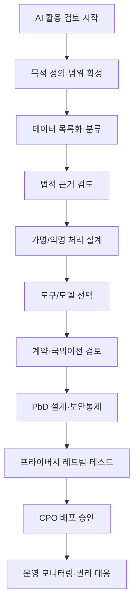

## 📌 가이드 개요 (Overview)
생성형 AI(Generative AI)의 급격한 확산으로 대규모 개인정보 처리와 관련된 새로운 법적·기술적 리스크가 증대되고 있습니다. 본 가이드는 AI 모델 개발자와 이용자가 준수해야 할 단계별 프라이버시 원칙과 전사적 거버넌스 구축을 위한 실무 프레임워크를 제시합니다.

## 📜 Version History

    

        v1.0
        2025-08-26
        

            <ul>
                <li>최초 작성: AI 수명주기별 개인정보 처리 원칙 및 거버넌스(RACI) 정립</li>
            </ul>
        

    

## ⚖️ 법적 근거 및 글로벌 표준
*   **국내**: 개인정보 보호법 제15조(수집·이용), 제28조의2(가명처리), 제33조(영향평가), 제37조의2(자동화된 결정 거부권) 등.
*   **글로벌**: NIST Privacy Framework 1.1, UK AI Playbook, EU EDPB AI Privacy Risks.

## 🏗️ AI 프라이버시 거버넌스 체계 (RACI)
CPO(개보책), CAIO(AI책임자), CISO(보안책임자) 간의 명확한 역할 분담을 통해 초기 단계부터 프라이버시 리스크를 관리합니다.

| 활동 | CPO | CAIO/AI리드 | CISO/보안팀 | 제품/개발 |
| :--- | :---: | :---: | :---: | :---: |
| 목적 정의 및 합법성 검토 | **A/R** | C | C | C |
| PII/민감정보 데이터 분류 | **A** | C | C | R |
| 개인정보 영향평가(PIA) 수행 | **A/R** | C | C | C |
| Privacy by Design(PbD) 정책 수립 | **A/R** | R | C | C |
| 보안 통제(접근/로깅) | A | C | **R** | R |
| AI 프라이버시 레드팀 운영 | A | **R** | **R** | R |
| 배포 및 운영 모니터링 | **A/R** | C | R | R |

> **A**: 책임(Accountable), **R**: 실행(Responsible), **C**: 협의(Consulted)

## 🛡️ 수명주기별 핵심 통제 (Lifecycle Gates)
1.  **기획 게이트**: 목적의 명확성 및 합법적 근거(동의, 계약, 정당한 이익) 확인.
2.  **데이터 게이트**: 출처 검증, 가명처리, 데이터 포이즈닝 방지 조치.
3.  **학습/정렬 게이트**: 미세조정(Fine-tuning) 및 정렬(Alignment) 시 프라이버시 안전장치 평가.
4.  **테스트/레드팀 게이트**: 프롬프트 인젝션, 로그 변조, 개인정보 추론 취약점 진단.
5.  **배포/운영 게이트**: AUP(허용이용정책) 공개 및 자동화된 결정에 대한 정보주체 권리 보장 체계 점검.

## 🔄 AI 프라이버시 검토 워크플로

## 🚩 핵심 지표 (KPI)
*   **합법성**: 개인정보 영향평가(PIA) 이행률 및 합법 근거 매핑률 100%.
*   **모델 안전**: 레드팀 시나리오 커버리지 및 탈옥(Jailbreak) 재현율 감소.
*   **권리 보장**: 자동화된 결정에 대한 거부·설명 요청 처리 SLA 준수율.

---

    본 거버넌스는 단순 기술 도입을 넘어 정책, 관리, 실행 점검이 유기적으로 작동하는 '보안 생태계' 구축을 지향합니다.

